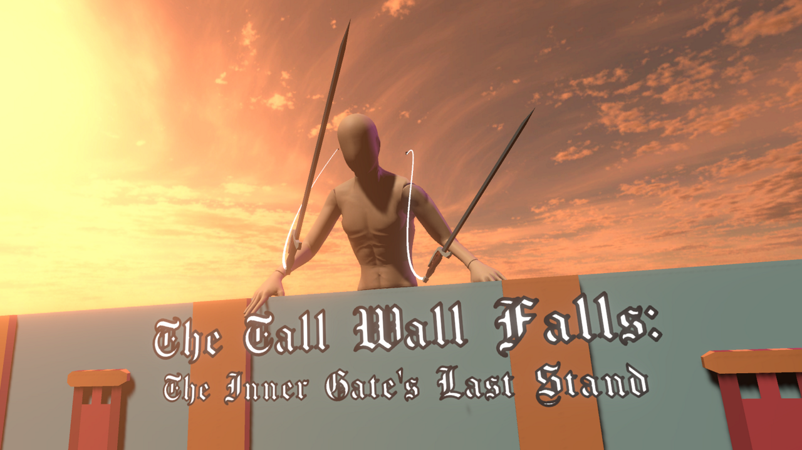

# The Tall Wall Falls: The Inner Gate's Last Stand

A fast-paced, physics-based, Attack on Titan inspired game. Swing around from the grapple hooks on your swords, and take down huge enemies, before they destroy the gate!
This was my submission to the "[Brackeys Game Jam 2021.1](https://itch.io/jam/brackeys-5)" game jam, which took place over 7 days.

    

You can download the game for free [here, on itch.io](https://request.itch.io/the-tall-wall-falls), or you can check out my other projects at [request.moe](https://request.moe). If you're interested, you can read the [postmortem for this project](./postmortem.md).

You're free to do whatever with this code, but if you do use it, it'd be real cool of you to link back to this page or the itch.io page (or both). Thanks!

## Setup

  1. Clone this repo
  2. Purchase and install [Shapes](https://assetstore.unity.com/packages/tools/particles-effects/shapes-173167) from the Unity Asset Store (Freya is super lovely, and the asset is really good - you should consider picking it up anyways!)
  3. Install the SteamVR plugin from the Asset Store

## Assets and Third Party Credits

### Project Settings:
  * Unity 2019.4.5f1
  * Universal RP (7.3.1)
  * SteamVR 2.7.2 (sdk 1.14.15)
  * ProBuilder (4.2.3)
  * ProGrids (Preview.6 - 3.0.3)
  * TextMesh Pro (2.0.1)
  * Visual Effect Graph (7.3.1)
  

### Third Party Assets:

<table>
	<tbody><tr>
		<td><strong>Resource</strong></td>
		<td><strong>Author</strong></td>
		<td><strong>License</strong></td>
		<td><strong>Modifications</strong></td>
	</tr>
	<tr>
		<td><a href="https://github.com/FreyaHolmer/Mathfs">Freya Holmer's Math Library (Mathfs)</a></td>
		<td>
<a href="https://twitter.com/FreyaHolmer">Freya Holmer</a> </td>
		<td><a href="https://github.com/FreyaHolmer/Mathfs/blob/master/LICENSE.txt">MIT License</a></td>
		<td>
 </td>
	</tr><tr>
		<td><a href="https://assetstore.unity.com/packages/tools/particles-effects/shapes-173167">Shapes</a></td>
		<td><a href="https://twitter.com/FreyaHolmer">Freya Holmer</a></td>
		<td>Paid asset store asset </td>
		<td>Not included in git repo </td>
	</tr>
	<tr>
		<td><a href="https://gist.github.com/mstevenson/4958837">mstevenson's Configurable Joint Extension methods</a></td>
		<td><a href="https://gist.github.com/mstevenson">Michael Stevenson</a> </td>
		<td>
 </td>
		<td>
 </td>
	</tr>
	<tr>
		<td><a href="https://www.mixamo.com/#/?query=manne&type=Character">Mixamo Mannequin Model</a></td>
		<td>
 </td>
		<td>
 </td>
		<td>
 </td>
	</tr>
	<tr>
		<td>Kenny's Low Poly Weapon Pack (No longer available for download)</td>
		<td><a href="https://www.kenney.nl/assets">Kenny</a></td>
		<td><a href="https://creativecommons.org/publicdomain/zero/1.0/">CC0 1.0</a></td>
		<td>Tweaked longsword model</td>
	</tr>
	<tr>
		<td><a href="https://www.kenney.nl/assets/city-kit-suburban">Kenny’s City Kit (Suburban)</a></td>
		<td><a href="https://www.kenney.nl/assets">Kenny</a></td>
		<td><a href="https://creativecommons.org/publicdomain/zero/1.0/">CC0 1.0</a></td>
		<td>
 </td>
	</tr>
	<tr>
		<td><a href="https://www.kenney.nl/assets/fantasy-town-kit">Kenny’s Fantasy Town Kit</a></td>
		<td><a href="https://www.kenney.nl/assets">Kenny</a></td>
		<td><a href="https://creativecommons.org/publicdomain/zero/1.0/">CC0 1.0</a></td>
		<td>
 </td>
	</tr>
	<tr>
		<td><a href="https://www.kenney.nl/assets/game-icons">Kenny’s Game Icons 1</a></td>
		<td><a href="https://www.kenney.nl/assets">Kenny</a></td>
		<td><a href="https://creativecommons.org/publicdomain/zero/1.0/">CC0 1.0</a></td>
		<td>
 </td>
	</tr>
	<tr>
		<td><a href="https://www.kenney.nl/assets/game-icons-expansion">Kenny’s Game Icons 2</a></td>
		<td><a href="https://www.kenney.nl/assets">Kenny</a></td>
		<td><a href="https://creativecommons.org/publicdomain/zero/1.0/">CC0 1.0</a></td>
		<td>Tweaked an icon to make an HMD icon</td>
	</tr>
	<tr>
		<td><a href="https://www.kenney.nl/assets/ui-pack-space-expansion">Kenny’s UI Pack; Space Expansion</a></td>
		<td><a href="https://www.kenney.nl/assets">Kenny</a></td>
		<td><a href="https://creativecommons.org/publicdomain/zero/1.0/">CC0 1.0</a></td>
		<td>
 </td>
	</tr>
	<tr>
		<td><a href="https://www.kenney.nl/assets/voiceover-pack-fighter">Kenny’s Voiceover Pack: Fighter</a></td>
		<td><a href="https://www.kenney.nl/assets">Kenny</a></td>
		<td><a href="https://creativecommons.org/publicdomain/zero/1.0/">CC0 1.0</a></td>
		<td>
 </td>
	</tr>
	<tr>
		<td><a href="https://www.kenney.nl/assets/impact-sounds">Kenny’s Impact Sounds</a></td>
		<td><a href="https://www.kenney.nl/assets">Kenny</a></td>
		<td><a href="https://creativecommons.org/publicdomain/zero/1.0/">CC0 1.0</a></td>
		<td>
 </td>
	</tr>
	<tr>
		<td><a href="https://www.kenney.nl/assets/interface-sounds">Kenny’s Interface Sounds</a></td>
		<td><a href="https://www.kenney.nl/assets">Kenny</a></td>
		<td><a href="https://creativecommons.org/publicdomain/zero/1.0/">CC0 1.0</a></td>
		<td>
 </td>
	</tr>
	<tr>
		<td><a href="https://opengameart.org/content/rpg-sound-pack">RPG Sound Pack</a></td>
		<td><a href="https://opengameart.org/users/artisticdude">artisticdude</a></td>
		<td><a href="https://creativecommons.org/publicdomain/zero/1.0/">CC0 1.0</a></td>
		<td>
 </td>
	</tr>
	<tr>
		<td><a href="https://opengameart.org/content/grass-001">Grass 001</a></td>
		<td><a href="https://opengameart.org/users/lamoot">Lamoot</a></td>
		<td><a href="https://creativecommons.org/licenses/by/3.0/">CC-BY 3.0</a></td>
		<td>
 </td>
	</tr>
	<tr>
		<td><a href="https://opengameart.org/content/dirt-001">Dirt 001</a></td>
		<td><a href="https://opengameart.org/users/lamoot">Lamoot</a></td>
		<td><a href="https://creativecommons.org/licenses/by/3.0/">CC-BY 3.0</a></td>
		<td>
 </td>
	</tr>
	<tr>
		<td><a href="https://opengameart.org/content/outdoor-stone-floor">Outdoor Stone Floor</a></td>
		<td><a href="https://opengameart.org/users/sindwiller">Sindwiller</a></td>
		<td><a href="https://creativecommons.org/licenses/by-sa/3.0/">CC-BY-SA 3.0</a></td>
		<td>
 </td>
	</tr>
	<tr>
		<td><a href="https://opengameart.org/content/heroes-theme">Heroes Theme</a></td>
		<td><a href="https://opengameart.org/users/alexandr-zhelanov">Alexander Zhelanov</a></td>
		<td><a href="https://creativecommons.org/licenses/by/3.0/">CC-BY 3.0</a></td>
		<td>
 </td>
	</tr>
	<tr>
		<td><a href="https://opengameart.org/content/5-chiptunes-action">5 Chiptunes (Action)</a></td>
		<td><a href="https://opengameart.org/users/subspaceaudio">SubspaceAudio</a></td>
		<td><a href="https://creativecommons.org/publicdomain/zero/1.0/">CC0 1.0</a></td>
		<td>
Converted from .wav to .ogg </td>
	</tr>
	<tr>
		<td><a href="https://opengameart.org/content/menu-music">Menu Music</a></td>
		<td><a href="https://opengameart.org/users/mrpoly">mrpoly</a></td>
		<td><a href="https://creativecommons.org/publicdomain/zero/1.0/">CC0 1.0</a></td>
		<td>
 </td>
	</tr>
	<tr>
		<td><a href="https://opengameart.org/content/clouds-skybox-1">Clouds Skybox 1</a></td>
		<td><a href="https://opengameart.org/users/lukerustltd">Luke.RUSTLTD</a></td>
		<td><a href="https://creativecommons.org/publicdomain/zero/1.0/">CC0 1.0</a></td>
		<td>
 </td>
	</tr>
	<tr>
		<td><a href="https://opengameart.org/content/zombie-skeleton-monster-voice-effects">Zombie / Skeleton / Monster Voice Effects</a></td>
		<td><a href="https://opengameart.org/users/arcadeparty">ArcadeParty</a></td>
		<td><a href="https://creativecommons.org/publicdomain/zero/1.0/">CC0 1.0</a></td>
		<td>
 </td>
	</tr>
	<tr>
		<td><a href="https://opengameart.org/content/fleshy-fight-sounds">Fleshy Fight Sounds</a></td>
		<td><a href="https://opengameart.org/users/willleamon">will_leamon</a></td>
		<td><a href="https://opengameart.org/content/oga-by-30-faq">OGA-BY 3.0</a></td>
		<td>
 </td>
	</tr>
	<tr>
		<td><a href="https://www.fontsquirrel.com/fonts/chomsky">Chomsky Font</a></td>
		<td><a href="https://www.fontsquirrel.com/fonts/list/foundry/fredrick-brennan">Fredrick Brennann</a></td>
		<td><a href="https://www.fontsquirrel.com/license/chomsky">SIL Open Font License</a></td>
		<td>
 </td>
	</tr>
	<tr>
		<td><a href="https://www.fontsquirrel.com/fonts/dejavu-serif">DejaVU Serif Font</a></td>
		<td><a href="https://www.fontsquirrel.com/fonts/list/foundry/dejavu-fonts">DejaVu Fonts</a></td>
		<td><a href="https://www.fontsquirrel.com/license/dejavu-serif">DejaVU Fonts License</a></td>
		<td>
 </td>
	</tr>
</tbody></table>
